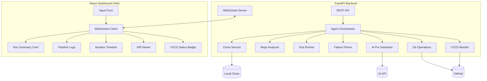

# RIFT 2026

**Autonomous AI DevOps Agent**

[](https://python.org)
[](https://fastapi.tiangolo.com)
[](https://react.dev)
[](https://sarvam.ai)
[](https://github.com/raidx545/AI-Dev-Autonomous-CI-CD-Healing-Agent)

RIFT 2026 is an intelligent, self-healing CI/CD pipeline agent. It automates the entire debugging lifecycle: cloning repositories, running tests, diagnosing failures, generating AI-powered fixes, and verifying the solutions through continuous integration.

---

## 🌟 Key Features

*   **Autonomous Healing**: Automatically detects test failures and generates code fixes without human intervention.
*   **Intelligent Analysis**: Uses Sarvam AI (`sarvam-m`) to understand code context and error logs.
*   **Smart Fix Strategies**:
    *   **Syntax Errors**: Directly targets file content.
    *   **Import Errors**: Resolves missing dependencies in test files.
    *   **Logic Bugs**: Analyzes source code to correct implementation flaws.
*   **Full Lifecycle Management**: Handles cloning, testing, branching, committing, pushing, and Pull Request creation.
*   **Real-time Dashboard**: A modern React-based UI for monitoring agent progress, viewing logs, and analyzing fix diffs.

---

## 🚀 Getting Started

### Prerequisites

*   **Python 3.11+**
*   **Node.js 18+**
*   **Git**
*   **GitHub Personal Access Token** (with `repo` scope)
*   **Sarvam AI API Key**

### Installation

1.  **Clone the Repository**
    ```bash
    git clone https://github.com/raidx545/AI-Dev-Autonomous-CI-CD-Healing-Agent.git
    cd AI-Dev-Autonomous-CI-CD-Healing-Agent
    ```

2.  **Configure Environment**
    Copy the example environment file and update it with your credentials:
    ```bash
    cp .env.example .env
    ```
    Edit `.env`:
    ```ini
    GITHUB_TOKEN=your_github_token
    SARVAM_API_KEY=your_sarvam_api_key
    MAX_ITERATIONS=5
    ```

3.  **Setup Backend**
    ```bash
    cd backend
    pip install -r requirements.txt
    python3 -m uvicorn app.main:app --host 0.0.0.0 --port 8080 --reload
    ```

4.  **Setup Frontend**
    Open a new terminal:
    ```bash
    cd frontend
    npm install
    npm run dev -- --port 5173
    ```

5.  **Access Dashboard**
    Open [http://localhost:5173](http://localhost:5173) in your browser.

---

## 🏗️ Architecture

The system consists of a FastAPI backend orchestrator and a React frontend dashboard, communicating via WebSockets for real-time updates.



---

## 🔧 Configuration

| Variable | Description | Required |
| :--- | :--- | :---: |
| `GITHUB_TOKEN` | GitHub Personal Access Token for repository interactions. | Yes |
| `SARVAM_API_KEY` | API Key for Sarvam AI (used for code generation). | Yes |
| `MAX_ITERATIONS` | Maximum number of fix attempts per run (Default: 5). | No |
| `PORT` | Backend server port (Default: 8080). | No |

---

## 🛠️ Technology Stack

*   **Backend**: Python, FastAPI, Uvicorn, GitPython
*   **AI Model**: Sarvam AI (`sarvam-m`)
*   **Frontend**: React, Vite, TailwindCSS (assumed styled), Framer Motion
*   **Communication**: WebSockets, REST API
*   **CI/CD**: GitHub Actions Integration

---

## 📄 License

This project is open source and available under the [MIT License](LICENSE).

---

<p align="center">
  Built with ❤️ for <strong>RIFT 2026</strong>
</p>
