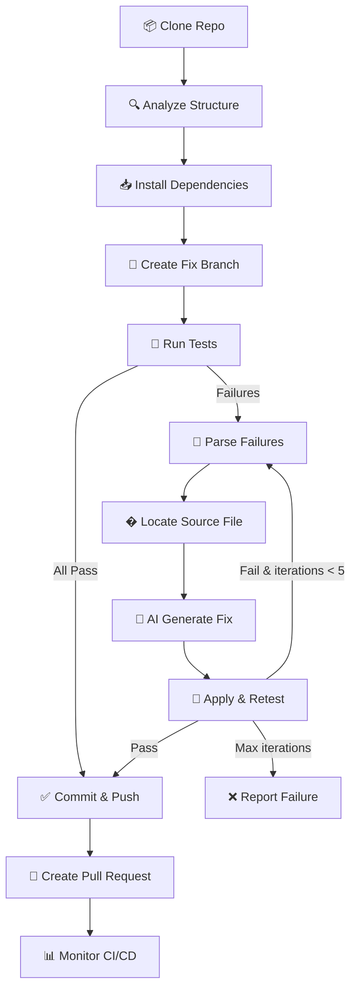

<](https://python.org)
[](https://fastapi.tiangolo.com)
[](https://react.dev)
[](https://vitejs.dev)
[](https://sarvam.ai)

</div>

---

## � What It Does

Give the agent a **GitHub repository URL** → it clones, tests, fixes bugs with AI, pushes a fix branch, and monitors CI/CD — all autonomously.

```
📦 Clone Repo → 🔍 Run Tests → 🤖 AI Fix → ✅ Retest → 🚀 Push & PR → 📊 Monitor CI
```

### Key Capabilities
- **Multi-language support** — Python (pytest), JavaScript (jest/vitest), Go, Java (Maven)
- **Smart error targeting** — Syntax errors, import errors, logic bugs, NameErrors
- **Iterative healing** — Up to 5 fix attempts per run with re-testing between each
- **Real-time dashboard** — WebSocket-powered live logs, diffs, and pipeline status
- **GitHub integration** — Auto-creates branches (`TEAM_LEADER_AI_Fix`), commits with `[AI-AGENT]` prefix, opens PRs, monitors GitHub Actions

---

## 🏗️ Architecture

```
┌──────────────────────────────────────────────────────┐
│              React Dashboard (Vite :5173)             │
│  InputForm │ RunSummary │ PipelineLogs │ DiffViewer   │
│                         ▲ WebSocket                   │
├──────────────────────────────────────────────────────┤
│              FastAPI Backend (:8080)                   │
│                Agent Orchestrator                      │
│  clone → analyze → test → fix → retest → push → CI   │
├──────────────────────────────────────────────────────┤
│  CloneService  TestRunner  FixGenerator  CICDMonitor  │
│           GitOps     Sarvam AI (sarvam-m)              │
└──────────────────────────────────────────────────────┘
        │              │                │
   GitHub Repo   Sarvam AI API   GitHub Actions
```

---

## 🚀 Quick Start

### Prerequisites
- Python 3.11+
- Node.js 18+
- GitHub Personal Access Token (with `repo` scope)
- Sarvam AI API Key

### 1. Clone & Configure

```bash
git clone https://github.com/raidx545/AI-Dev-Autonomous-CI-CD-Healing-Agent.git
cd AI-Dev-Autonomous-CI-CD-Healing-Agent
cp .env.example .env
```

Edit `.env` with your actual keys:
```env
GITHUB_TOKEN=ghp_your_personal_access_token
SARVAM_API_KEY=your_sarvam_api_key
MAX_ITERATIONS=5
```

### 2. Start Backend

```bash
cd backend
pip install -r requirements.txt
python3 -m uvicorn app.main:app --host 0.0.0.0 --port 8080 --reload
```

### 3. Start Frontend

```bash
cd frontend
npm install
npm run dev -- --port 5173
```

### 4. Run the Agent

Open `http://localhost:5173` in your browser, enter a GitHub repo URL, team name, and leader name, then click **Run Agent**.

Or via API:
```bash
curl -X POST http://localhost:8080/api/runs \
  -H "Content-Type: application/json" \
  -d '{"repo_url":"https://github.com/owner/repo","team_name":"MyTeam","leader_name":"MyName"}'
```

---

## 📡 API Reference

| Method | Endpoint | Description |
|--------|----------|-------------|
| `GET` | `/` | Service info |
| `GET` | `/health` | Health check |
| `POST` | `/api/runs` | Start a new agent run |
| `GET` | `/api/runs/{run_id}` | Get run status & summary |
| `GET` | `/api/runs` | List all runs |
| `WS` | `/ws/{run_id}` | Real-time event stream |

### WebSocket Events
| Event | Description |
|-------|-------------|
| `phase_change` | Agent moved to a new phase (cloning, testing, fixing...) |
| `log` | Informational message |
| `error` | Something went wrong |
| `ping` | Keepalive |

---

## 🧠 How the Agent Works



### Smart Error Resolution

| Error Type | Strategy | Action |
|------------|----------|--------|
| `SyntaxError` / `IndentationError` | Strategy -1 | Fix the file itself (highest priority) |
| `ModuleNotFoundError` | Strategy 0 | Fix imports in the test file |
| `NameError` (missing import) | Strategy 0b | Add missing import to test file |
| `AssertionError` / Logic bugs | Strategy 1-4 | AI-powered fix on the source module |

---

## � Project Structure

```
Rift2026/
├── .env.example              # Environment template
├── backend/
│   ├── requirements.txt      # Python dependencies
│   └── app/
│       ├── config.py         # Pydantic settings
│       ├── models.py         # Data models
│       ├── agent.py          # Core orchestrator
│       ├── main.py           # FastAPI app + WebSocket
│       └── services/
│           ├── clone_service.py   # Git clone + detection
│           ├── test_runner.py     # Test execution & parsing
│           ├── fix_generator.py   # AI fix generation
│           ├── git_ops.py         # Branch, commit, push
│           └── cicd_monitor.py    # GitHub Actions polling
└── frontend/
    ├── package.json
    └── src/
        ├── App.jsx
        ├── index.css              # Dark glassmorphism theme
        ├── context/AgentContext.jsx
        ├── hooks/useWebSocket.js
        └── components/
            ├── InputForm.jsx
            ├── RunSummaryCard.jsx
            ├── PipelineLogs.jsx
            ├── IterationTimeline.jsx
            ├── DiffViewer.jsx
            └── CICDStatus.jsx
```

---

## ⚙️ Environment Variables

| Variable | Required | Description |
|----------|----------|-------------|
| `GITHUB_TOKEN` | ✅ | GitHub Personal Access Token with `repo` scope (for cloning, pushing, and PR creation) |
| `SARVAM_API_KEY` | ✅ | [Sarvam AI](https://sarvam.ai) API key — powers the `sarvam-m` model for intelligent code fix generation |
| `MAX_ITERATIONS` | ❌ | Maximum fix-retest cycles per run (default: `5`) |

---

## 🛠️ Tech Stack

| Layer | Technologies |
|-------|-------------|
| **Backend** | Python 3.11+ · FastAPI · Uvicorn · GitPython · Pydantic · httpx |
| **AI Engine** | [Sarvam AI](https://sarvam.ai) (`sarvam-m` model) via REST API |
| **Frontend** | React 19 · Vite 6 · Framer Motion · Lucide React · Axios |
| **Real-time** | WebSocket (native) · Server-Sent Events |
| **CI/CD** | GitHub Actions API · GitHub REST API v3 |

---

## � Example Output

```json
{
  "total_failures_detected": 1,
  "total_fixes_applied": 1,
  "cicd_status": "passed",
  "total_time_seconds": 42.76,
  "score": {
    "base_score": 100,
    "speed_bonus": 10,
    "final_score": 110
  },
  "fixes": [
    {
      "file": "math_utils.py",
      "bug_type": "LOGIC",
      "commit_message": "[AI-AGENT] Fix LOGIC in math_utils.py",
      "status": "fixed"
    }
  ]
}
```

---

## � License

This project was built for **RIFT 2026** — an AI-powered DevOps hackathon.

---

<div align="center">

**Built with ❤️ for RIFT 2026**

</div>
]]>
